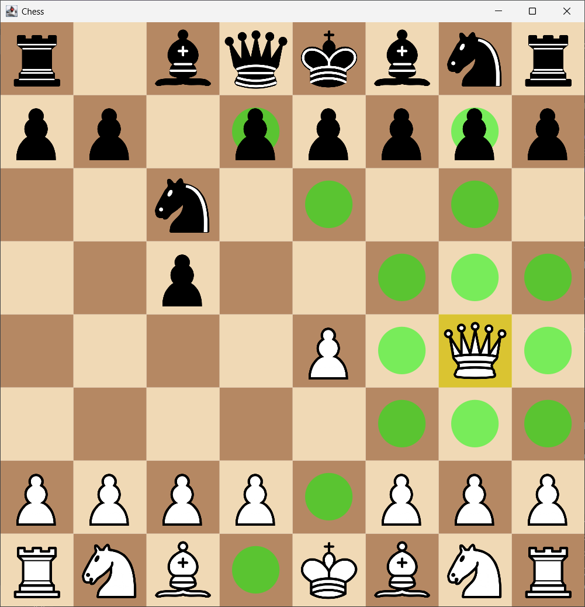
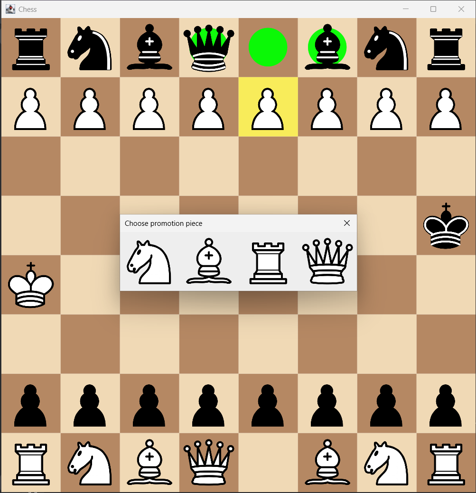
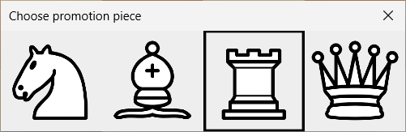

# Chess

A simple, clean Java 21 desktop chess application built with Swing.
The project focuses on clear architecture, separation of UI and logic, and an easily maintainable rendering system.

<p align="center"> 
     
</p>

## Features

- Full chess rules
- Move highlighting
- Legal move validation
- Smooth board scaling
- Pawn promotion dialog with selectable pieces

## Promotion Examples

<div align="center"> 
     
     
     
</div>

## Build & Run

### To compile:

```mvn clean install```

### To run:

```java -jar target/chess-1.0.0.jar```

or

run SwingMain class manually through your IDE